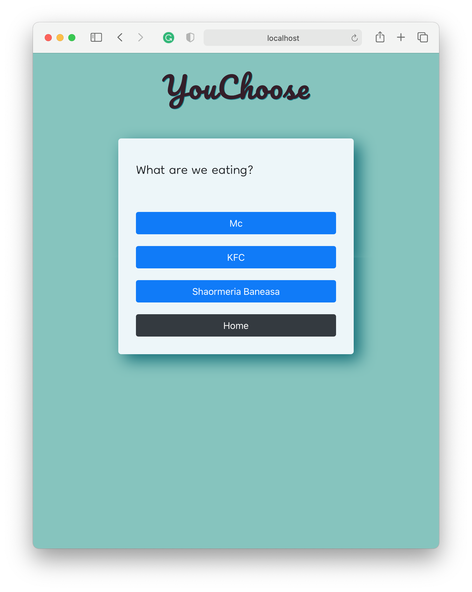

# YouChoose
Anonymous voting system

## Table of Contents
  - [Getting Started](#getting-started)
    - [Prerequisites](#prerequisites)
    - [Run](#run)
    - [Stop](#stop)
  - [Deployment](#deployment)
    - [Create swarm](#create-swarm)
    - [Copy application](#copy-application)
    - [Deploy app](#deploy-app)
    - [Check status](#check-status)
    - [Remove app](#remove-app)
  - [Built With](#built-with)
  - [Architecture](#architecture)
    - [Frontend](#frontend)
    - [Api Gateway](#api-gateway)
    - [Auth](#auth)
    - [Core](#core)
    - [IO](#io)
    - [Database](#database)
    - [Email](#email)
    - [Adminer](#adminer)
  - [Screenshots](#screenshots)
  - [Authors](#authors)

## Getting Started

### Prerequisites

Create your secret files:

```bash
mkdir secrets
echo my_super_db             > secrets/database_db
echo my_super_user           > secrets/database_user
echo my_super_password       > secrets/database_password
echo my_super_email          > secrets/email_address
echo my_super_email_password > secrets/email_password
echo my_uuper_auth_jwt_key   > auth_jwt_key
```

You can also run ```secrets.sh``` script to generate those files:

```bash
./secrets.sh
```

In order to run this project, you must have installed [docker-compose](https://docs.docker.com/compose/install/).

### Run

To run the project on a local environment, use:
```bash
# run
docker-compose up

# run in detached mode (background)
docker-compose up -d

# rebuild images
docker-compose up --build
```

### Stop

To run the the docker stack, use:
```bash
# stop
docker-compose down

# stop and remove created volumes
docker-compose down -v
```

## Deployment

### Create swarm

```bash
# create 3 docker machines
docker-machine create machine-1
docker-machine create machine-2
docker-machine create machine-3
```

```bash
# init swarm
docker-machine ssh machine-1
docker swarm init --advertise-addr <192.168.XXX.XXX>
exit
```

```bash
# join swarm
docker-machine ssh machine-2
docker swarm join --token <TOKEN> <192.168.XXX.XXX>:2377
exit
docker-machine ssh machine-3
docker swarm join --token <TOKEN> <192.168.XXX.XXX>:2377
exit
```

### Copy application
```bash
docker-machine scp docker-compose-stack.yml machine-1:.
docker-machine scp -r secrets machine-1:.
docker-machine scp -r kong machine-1:.
```

### Deploy app
```bash
docker-machine ssh machine-1
docker stack deploy -c docker-compose-stack.yml you-choose
```

### Check status
```bash
docker-machine ssh machine-1
docker stack ps you-choose
```

### Remove app
```bash
docker-machine ssh machine-1
docker stack rm you-choose
exit
docker-machine rm machine-1
docker-machine rm machine-2
docker-machine rm machine-3
```

## Built With

[Python](https://www.python.org) with [Flask](https://flask.palletsprojects.com/en/1.1.x/) for backend

[React](https://reactjs.org) for frontend

[PostgreSQL](https://www.postgresql.org) for database

[Kong](https://konghq.com/kong/) for Api Gateway

[Docker](https://www.docker.com) for container orchestration

## Architecture


### Frontend

WIP

### Api Gateway

WIP

### Auth

WIP
### Core

WIP

### IO

WIP

### Database

WIP

### Email

WIP

### Adminer

WIP

## Screenshots





## Authors

[Marian-Vlăduț Jorăscu](https://github.com/majmv)

[Gabriel David Roșu](https://github.com/rosudavidg)

[Andrei-Liviu Samoilă](https://github.com/Andrei-Liviu)
